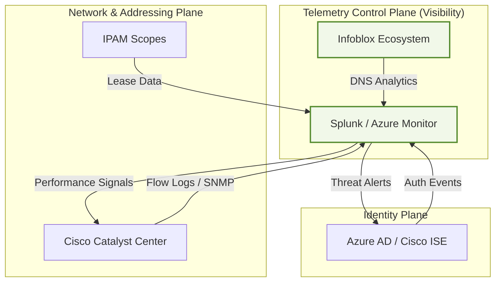

# Visibility & Telemetry Control Plane

Modernization requires more than just connectivity; it requires a continuous feedback loop between infrastructure, security, and operations.

## Closed-Loop Integration
This visualization shows how real-time signals inform policy and security decisions.

### Telemetry Sources
The agency utilizes the following telemetry anchors to maintain the "Modernization Atlas" accuracy:
- **Splunk:** Primary SIEM for security events and performance analytics.
- **Azure Monitor:** Cloud-native metrics for Azure AD and hybrid workloads.
- **Infoblox Ecosystem:** DNS analytics and IPAM change tracking.

All telemetry keys are normalized in `generate.py` to ensure consistent data ingestion.