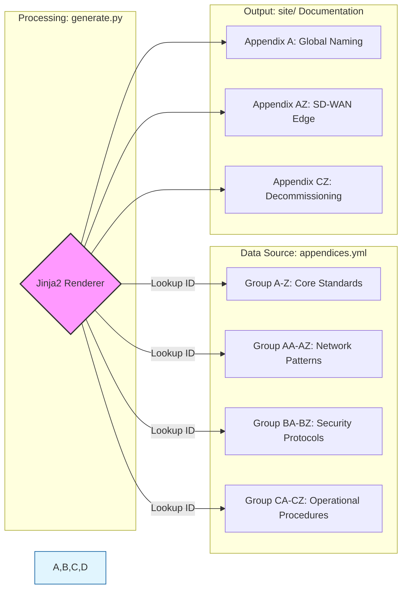

# Appendix Canon Library

This library contains the 104 standardized technical and operational patterns (A-CZ) used across the Modernization Atlas.

## Library Overview

## Table of Contents

### Core Standards (A-Z)

| ID | Title | Status |
|---|---|---|

### Network Patterns (AA-AZ)

| ID | Title | Status |
|---|---|---|

### Security Protocols (BA-BZ)

| ID | Title | Status |
|---|---|---|

### Operational Procedures (CA-CZ)

| ID | Title | Status |
|---|---|---|

---

### Implementation Notes

* **Logic Check:** The iteration logic assumes YAML keys start with the group prefix (e.g., `A-01`, `BA-02`).
* **Normalization:** Hyphen-to-underscore conversion is applied by `generate.py` before rendering.

---
*Generated by the UIAO-Core Pipeline*