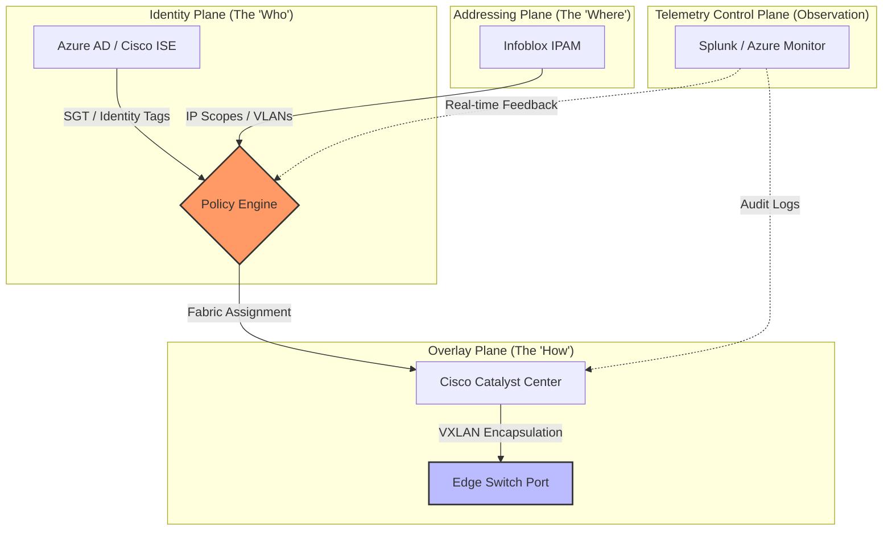

# Modernization Atlas: Unified Architecture

This document outlines the three-plane model driving the agency's IT transformation. By decoupling Identity, Addressing, and the Overlay, we achieve a vendor-agnostic, programmable infrastructure.

## Architectural Convergence

The following diagram visualizes the intersection of user identity and network location.

## Core Pillars

1. **Identity Plane:** Centralized authority via Azure AD and Cisco ISE.
2. **Addressing Plane:** Automated IPAM lifecycle management using Infoblox.
3. **Overlay Plane:** Fabric-based transport (SD-Access/SD-WAN) that enforces policy regardless of physical location.

Reference Site ID: GLOBAL

---
*Generated by the UIAO-Core Pipeline*