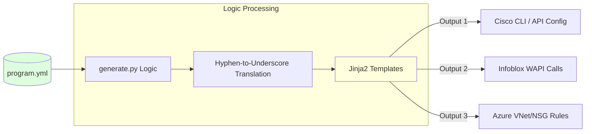
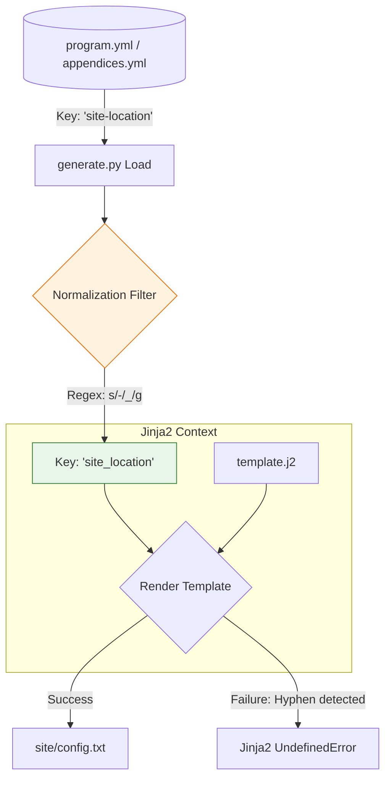

# Pipeline Logic & Data Normalization

The **uiao-core** repository functions as a compiler for infrastructure. It translates high-level intent into multi-vendor configurations.

## The Data Pipeline

How `program.yml` becomes a deployed configuration:

## Jinja2 Normalization

To prevent `UndefinedError` within templates, all YAML keys undergo a **hyphen-to-underscore** translation before rendering.

### Key Mapping Example

- **Source Key:** `wan-interface-id`
- **Jinja2 Variable:** ``

---
*Generated by the uiao-core Development Pipeline*